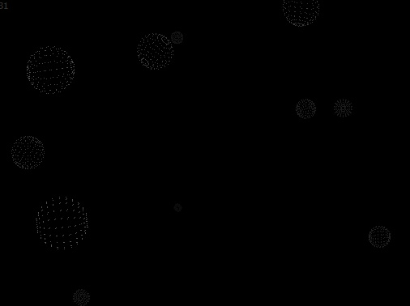



## Starfield Screen saver with 3D rotating spheres \(for stars\)

### Description

Star field screen saver, but with rotating 3 dimensional spheres. Set bBUILDMODE=True for form sized, bBUILDMODE=False for full multi monitor screen saver. Set SetupStars / ReDim uStars(20) to the number of balls on screen at any one time. uStars().q controls Theta, .w controls Alt, .r=ball radius
 
### More Info
 

             |
---                |---
**Submitted On**   |2006-07-18 09:09:20
**By**             |[Michael Toye](https://github.com/Planet-Source-Code/PSCIndex/blob/master/ByAuthor/michael-toye.md)
**Level**          |Intermediate
**User Rating**    |5.0 (15 globes from 3 users)
**Compatibility**  |VB 6\.0
**Category**       |[Complete Applications](https://github.com/Planet-Source-Code/PSCIndex/blob/master/ByCategory/complete-applications__1-27.md)
**World**          |[Visual Basic](https://github.com/Planet-Source-Code/PSCIndex/blob/master/ByWorld/visual-basic.md)
**Archive File**   |[Starfield\_2147143182009\.zip](https://github.com/Planet-Source-Code/michael-toye-starfield-screen-saver-with-3d-rotating-spheres-for-stars__1-71881/archive/master.zip)

